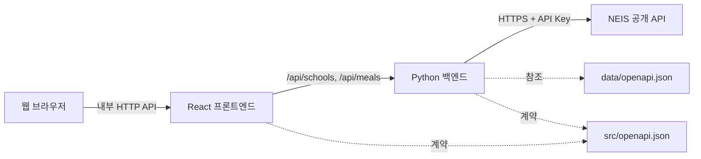

# 급식 배틀 - 학교 급식 조회 앱 TRD

## 1. 문서 개요

이 문서는 `PRD.md`의 요구사항을 구현하기 위한 기술 설계를 정의한다. 시스템은
React 기반 프론트엔드와 Python 기반 백엔드로 분리하며, Docker Compose로 함께
빌드하고 실행한다.

## 2. 설계 원칙

- 브라우저는 NEIS API를 직접 호출하지 않는다.
- NEIS API 키는 백엔드 환경 변수로만 관리한다.
- `data/openapi.json`을 NEIS 외부 API 계약의 기준으로 사용한다.
- 프론트엔드와 백엔드 사이의 계약은 구현 시 `src/openapi.json`으로 별도
  정의한다.
- 외부 응답은 신뢰하지 않고 백엔드 경계에서 검증하고 내부 응답 모델로
  변환한다.
- 빈 결과, 입력 오류, 외부 서비스 오류를 서로 다른 상태로 처리한다.

## 3. 시스템 구성



### 런타임 책임

| 구성 요소 | 책임 | 금지 사항 |
|-----------|------|-----------|
| React 프론트엔드 | 3단계 UI, 사용자 입력 검증, 내부 API 호출, 로딩·빈 상태·오류 표시 | NEIS 직접 호출, NEIS API 키 저장 또는 노출 |
| Python 백엔드 | 내부 API 제공, 입력 검증, NEIS 클라이언트 호출, 외부 응답 검증 및 변환, 오류 매핑 | 외부 응답의 무검증 전달, API 키 로깅 |
| NEIS 클라이언트 | `data/openapi.json`에 정의된 요청 생성과 응답 파싱 | UI나 내부 HTTP 응답에 종속된 로직 |
| Docker Compose | 프론트엔드와 백엔드 빌드, 네트워크 연결, 개발·검증 실행 환경 제공 | 비밀 값을 이미지에 포함 |

## 4. 권장 소스 구조

구현 단계에서 다음 책임 분리를 기준으로 하되, 선택한 프레임워크의 관례에 맞게
세부 경로는 조정할 수 있다.

```text
.
├─ src/
│  ├─ openapi.json              # 프론트엔드-백엔드 내부 API 계약
│  ├─ frontend/
│  │  ├─ src/
│  │  │  ├─ components/
│  │  │  ├─ api/               # 내부 API 클라이언트
│  │  │  └─ types/
│  │  └─ Dockerfile
│  └─ backend/
│     ├─ app/
│     │  ├─ api/               # 내부 HTTP 엔드포인트
│     │  ├─ clients/           # NEIS 전용 클라이언트
│     │  ├─ models/            # 외부 및 내부 데이터 모델
│     │  ├─ services/          # 조회와 변환 로직
│     │  └─ config/            # 검증된 환경 설정
│     ├─ tests/
│     └─ Dockerfile
├─ tests/
│  └─ e2e/
└─ compose.yaml
```

프론트엔드의 내부 API 클라이언트와 백엔드의 NEIS 클라이언트는 분리한다.
`data/openapi.json`은 외부 NEIS 계약이며, `src/openapi.json`은 제품 내부 계약이므로
서로 대체하지 않는다.

## 5. 데이터 흐름

### 5.1 학교 검색

1. 프론트엔드는 검색어의 앞뒤 공백을 제거하고 비어 있지 않은지 검증한다.
2. 프론트엔드는 내부 학교 검색 API에 검색어를 전달한다.
3. 백엔드는 쿼리를 검증한 뒤 NEIS `/hub/schoolInfo`를 호출한다.
4. NEIS 요청에는 JSON 응답 형식과 백엔드에 저장된 API 키를 적용한다.
5. 백엔드는 NEIS 응답을 검증하고 내부 `SchoolSummary` 목록으로 변환한다.
6. 백엔드는 NEIS의 전체 건수와 페이지 정보를 확인하고, 내부 계약의 결과
   상한을 초과하면 응답에 결과가 더 있음을 명시한다.
7. 프론트엔드는 목록, 명시적인 빈 상태 또는 더 구체적인 검색어가 필요하다는
   상태를 표시한다. 개발용 샘플 키의 제한된 페이지 크기에 의존하지 않는다.

### 5.2 중식 조회

1. 프론트엔드는 선택한 학교 코드, 교육청 코드, 시작일, 종료일을 내부 급식
   API에 전달한다.
2. 프론트엔드와 백엔드는 시작일이 종료일보다 늦지 않은지 검증한다.
3. 백엔드는 NEIS `/hub/mealServiceDietInfo`에 다음 조건을 전달한다.
   - `ATPT_OFCDC_SC_CODE`: 선택한 학교의 교육청 코드
   - `SD_SCHUL_CODE`: 선택한 학교의 행정표준코드
   - `MMEAL_SC_CODE`: 중식 코드
   - `MLSV_FROM_YMD`, `MLSV_TO_YMD`: 조회 시작일과 종료일
4. 백엔드는 내부 API의 `YYYY-MM-DD` 날짜를 NEIS가 요구하는 `YYYYMMDD`로
   변환한다.
5. 백엔드는 중식 결과만 허용하고 내부 `Meal` 목록으로 변환한다.
6. 백엔드는 급식일 오름차순으로 정렬된 결과를 반환한다.
7. 백엔드는 열량과 영양 정보에서 수치, 항목명, 단위를 분리해 내부 측정값
   모델로 정규화한다.
8. 프론트엔드는 날짜별 결과 또는 명시적인 급식 없음 상태를 표시하고,
   정규화된 수치형 정보가 있으면 원본 값과 함께 차트로 시각화한다.

## 6. API 계약

### 6.1 계약 관리

- 구현 시 OpenAPI 3.x 형식의 `src/openapi.json`을 생성하고 내부 엔드포인트,
  요청 매개변수, 응답 스키마, 상태 코드를 정의한다.
- 프론트엔드와 백엔드는 동일한 `src/openapi.json`을 계약 기준으로 사용한다.
- 프론트엔드는 내부 계약에 대응하는 별도 클라이언트 모듈을 구현한다.
- 백엔드는 `data/openapi.json`에 대응하는 별도 NEIS 클라이언트 모듈을
  구현한다.
- 계약이 변경되면 문서와 양쪽 클라이언트/서버 구현 및 계약 검증 테스트를 함께
  갱신한다.

### 6.2 내부 엔드포인트

구현 시 아래 의미를 보존하며 최종 경로와 스키마는 `src/openapi.json`으로
확정한다.

#### `GET /api/schools?name={partialName}`

부분 학교명으로 학교를 검색한다.

성공 응답은 `items`, `total`, `hasMore`를 포함한다. `items`의 최대 건수는 내부
계약에 명시하고, `hasMore`가 참이면 프론트엔드는 검색어를 구체화하도록
안내한다. 학교 항목:

| 필드 | 타입 | 필수 | 설명 |
|------|------|------|------|
| `officeCode` | string | 예 | 시도교육청 코드 |
| `schoolCode` | string | 예 | 학교 행정표준코드 |
| `name` | string | 예 | 학교명 |
| `region` | string | 예 | 소재 지역 |
| `schoolType` | string | 예 | 학교 종류 |

#### `GET /api/meals`

필수 쿼리 매개변수:

| 필드 | 형식 | 설명 |
|------|------|------|
| `officeCode` | string | 시도교육청 코드 |
| `schoolCode` | string | 학교 행정표준코드 |
| `from` | `YYYY-MM-DD` | 조회 시작일 |
| `to` | `YYYY-MM-DD` | 조회 종료일 |

성공 응답의 급식 항목:

| 필드 | 타입 | 필수 | 설명 |
|------|------|------|------|
| `date` | date | 예 | 급식일 |
| `mealType` | string | 예 | 중식 식사 구분 |
| `menu` | string 배열 | 예 | NEIS 요리명을 항목별로 정규화한 메뉴 |
| `calories` | `Measurement` | 아니요 | 정규화한 NEIS 열량 정보 |
| `nutrients` | `Measurement` 배열 | 예 | 정규화 가능한 NEIS 영양소 정보, 없으면 빈 배열 |
| `nutritionText` | string | 아니요 | 정규화하지 못한 내용을 포함한 NEIS 영양 정보 원문 |
| `origin` | string | 아니요 | NEIS 원산지 정보 |

백엔드는 NEIS `DDISH_NM`의 구분 형식을 해석해 `menu` 문자열 배열로 정규화하며,
프론트엔드는 NEIS 원본 응답의 줄바꿈 규칙을 직접 해석하지 않는다.
`Measurement`는 `label: string`, `value: number`, `unit: string`,
`sourceText: string`을 포함한다. `sourceText`는 차트와 함께 원본 표현을 확인할
수 있도록 보존한다.
백엔드는 `CAL_INFO`와 `NTR_INFO`에서 확인 가능한 수치와 단위만 변환하고,
해석하지 못한 값은 추정하지 않는다. `nutritionText`는 원본 정보 확인과 텍스트
대체 표시를 위해 보존한다.

### 6.3 상태 코드와 오류 모델

| 상태 | 의미 | 프론트엔드 처리 |
|------|------|-----------------|
| `200` | 성공. 목록이 비어 있을 수 있음. NEIS가 HTTP 404 또는 본문 결과 코드로 알린 정상적인 데이터 없음도 여기에 매핑 | 결과 또는 빈 상태 표시 |
| `400` 또는 `422` | 누락되거나 유효하지 않은 입력 | 해당 입력 안내 표시 |
| `429` | 애플리케이션 또는 NEIS 요청 제한 | 잠시 후 재시도 안내 |
| `502` | NEIS 오류 또는 잘못된 외부 응답 | 외부 서비스 조회 실패 안내 |
| `503` | NEIS 연결 불가 또는 일시적 서버 장애 | 재시도 안내 |
| `500` | 처리되지 않은 내부 오류 | 일반 오류 안내 및 서버 측 추적 |

오류 응답은 최소한 안정적인 `code`와 사용자 노출 가능한 `message`를 포함한다.
상세 스택, API 키, NEIS 요청 URL의 인증 쿼리는 반환하지 않는다. 데이터가 없는
정상 응답은 오류 상태 코드로 바꾸지 않는다.

## 7. 외부 NEIS API 연동

- 기준 명세: `data/openapi.json`
- 서버: `https://open.neis.go.kr`
- 학교 검색: `GET /hub/schoolInfo`
- 급식 조회: `GET /hub/mealServiceDietInfo`
- 인증: 쿼리 매개변수 `Key`; 백엔드 환경 변수에서 주입
- 응답 형식: JSON

NEIS는 HTTP 성공 응답 안에도 결과 코드와 빈 데이터 안내를 포함할 수 있으므로,
HTTP 상태와 응답 본문의 `RESULT`를 모두 검사한다. 인증 실패, 잘못된 요청,
데이터 없음, 요청 제한, 서버 오류를 내부 상태로 명시적으로 매핑한다.
NEIS가 조회 결과 없음을 HTTP `404` 또는 성공 응답 본문의 안내 코드로 표현한
경우 내부 API는 이를 오류로 변환하지 않고 빈 목록의 `200` 응답으로 반환한다.
실제 서비스 또는 리소스 오류인 `404`만 외부 서비스 오류로 매핑한다.

외부 응답의 필수 식별 필드와 날짜 형식을 런타임에 검증한다. 선택적 부가 필드는
명세상 필수로 표시되어 있더라도 빈 문자열 또는 누락 가능성을 방어적으로
처리하되, 값을 추정하거나 성공 모양의 기본 데이터로 대체하지 않는다.

## 8. 프론트엔드 설계

### 상태 모델

- 학교 검색어, 검색 진행 상태, 검색 결과, 검색 오류
- 선택된 학교
- 시작일, 종료일, 입력 검증 오류
- 급식 조회 진행 상태, 결과, 빈 상태, 조회 오류

학교가 변경되면 이전 급식 결과와 조회 오류를 초기화한다. 새 요청이 시작되면
이전 요청의 늦은 응답이 최신 화면을 덮어쓰지 않도록 취소 또는 요청 식별자를
사용한다.

### UI 구성

1. 학교 검색 및 선택 컴포넌트
2. 날짜 범위 선택 컴포넌트
3. 날짜별 중식 결과 컴포넌트
4. 수치형 급식 정보 차트 컴포넌트

로딩 중 관련 제출 동작을 비활성화한다. 오류 메시지는 해당 입력이나 결과
영역과 연결하고, 학교 검색과 급식 조회 오류를 독립적으로 관리한다.

차트는 동일한 항목과 단위의 값만 같은 축에서 비교한다. 날짜별 열량과 한 끼의
영양소처럼 비교 의미가 다른 데이터는 별도 차트로 구분한다. 모든 차트에는 축,
단위, 범례 또는 데이터 레이블과 텍스트 대체 정보를 제공한다. 수치형 정보가
없으면 빈 차트를 렌더링하지 않고 기존 텍스트 결과만 표시한다.

## 9. 백엔드 설계

### 계층별 책임

- API 계층: HTTP 입력 파싱, 스키마 검증, 상태 코드와 오류 모델 반환
- 서비스 계층: 유스케이스 실행, 중식 조건 보장, 정렬과 내부 모델 변환
- NEIS 클라이언트: 인증된 외부 요청, 타임아웃, 외부 오류 및 응답 파싱
- 설정 계층: 시작 시 필수 환경 변수 검증

HTTP 클라이언트는 연결 및 응답 타임아웃을 설정한다. 재시도는 일시적인 연결
오류나 안전한 조회 요청에 한해 제한된 횟수로 적용할 수 있으며, 입력 오류,
인증 오류, 요청 제한을 무분별하게 재시도하지 않는다.

### 환경 설정

| 변수 | 필수 | 설명 |
|------|------|------|
| `NEIS_API_KEY` | 예 | 서버 측 NEIS API 키 |
| `NEIS_BASE_URL` | 아니요 | 기본값은 명세의 NEIS 서버 URL |
| `BACKEND_PORT` | 아니요 | 백엔드 수신 포트 |
| `FRONTEND_ORIGIN` | 환경별 | 허용할 프론트엔드 출처 |

실제 비밀 값은 저장소에 커밋하지 않는다. `.env.example`에는 변수 이름과 안전한
예시만 제공한다.

## 10. Docker Compose 구성

- `frontend`와 `backend` 서비스를 각각의 Dockerfile에서 빌드한다.
- 프론트엔드는 Compose 서비스 이름 또는 브라우저에서 접근 가능한 프록시
  경로를 통해 백엔드와 통신한다.
- 브라우저에 노출되는 프론트엔드 환경에는 `NEIS_API_KEY`를 전달하지 않는다.
- 백엔드 헬스 체크를 제공하고 프론트엔드의 기동 순서를 설정할 수 있다.
- 필요한 포트만 호스트에 공개하고 서비스 간 통신은 Compose 네트워크를
  사용한다.
- 개발자 환경 설정은 `.env`로 주입하되 Compose 파일이나 이미지 레이어에 비밀
  값을 하드코딩하지 않는다.

단일 Compose 명령으로 두 서비스를 빌드하고 실행할 수 있어야 하며, 종료 시
서비스와 네트워크를 정리할 수 있어야 한다.

## 11. 테스트 전략

### 11.1 프론트엔드 통합 테스트

프론트엔드에는 별도 단위 테스트를 요구하지 않고, 사용자 관점의 컴포넌트 통합
테스트를 작성한다. 내부 API는 실제 계약과 같은 응답으로 모킹한다.

- 부분 학교명 검색 후 결과 표시
- 학교 선택 후 날짜 단계 활성화
- 유효한 날짜 범위로 조회 후 날짜별 중식 표시
- 수치와 단위가 있는 열량 및 영양소의 차트와 동일한 텍스트 값 표시
- 서로 다른 단위의 값을 같은 차트 척도에 혼합하지 않음
- 수치형 정보가 없을 때 빈 차트를 표시하지 않음
- 검색 결과 없음과 급식 정보 없음 표시
- 빈 검색어, 학교 미선택, 누락 날짜, 역전된 날짜 범위 검증
- 내부 API의 요청 제한 및 서버 오류 표시
- 학교 변경 시 이전 급식 결과 초기화
- 키보드 기반 핵심 흐름과 접근 가능한 레이블 확인

### 11.2 백엔드 단위 테스트

- 날짜 입력 및 날짜 범위 검증
- NEIS 학교와 급식 응답을 내부 모델로 변환
- 중식 조건 적용과 급식일 정렬
- 메뉴, 열량, 영양소 및 선택적 부가 필드 정규화
- 숫자로 해석할 수 없는 영양 정보는 추정하지 않고 원문을 보존함
- NEIS 결과 코드와 예외를 내부 오류로 매핑
- 잘못된 외부 응답 거부
- 로그와 오류 응답에 API 키가 포함되지 않음

### 11.3 백엔드 통합 테스트

외부 NEIS 서버는 결정적인 테스트 더블로 대체하고 실제 HTTP 경계를 포함해
검증한다.

- 학교 검색 엔드포인트의 요청, 변환 및 성공 응답
- 학교 검색 결과가 내부 상한을 초과할 때 `total`과 `hasMore`가 정확함
- 급식 조회 엔드포인트가 교육청·학교·중식·기간 조건을 전달함
- 정규화된 측정값의 수치와 단위가 NEIS 원본과 일치함
- 빈 결과를 빈 목록으로 반환함
- NEIS가 HTTP 404 또는 본문 결과 코드로 알린 데이터 없음을 빈 `200`으로 변환함
- 잘못된 요청의 4xx 응답
- NEIS 인증, 요청 제한, 서버 오류 및 타임아웃의 상태 코드 매핑
- `src/openapi.json`과 실제 내부 API 응답의 계약 일치

### 11.4 E2E 테스트

Docker Compose로 프론트엔드와 백엔드를 실행하고, 통제 가능한 NEIS 대역 또는
고정 테스트 응답을 사용한다.

- 학교명 일부 검색 → 학교 선택 → 날짜 범위 선택 → 중식 결과 확인
- 수치형 급식 정보가 원본 값과 동일한 차트 및 텍스트로 표시됨
- 학교 검색 결과 없음
- 잘못된 날짜 범위로 조회 차단
- 기간 내 급식 정보 없음
- 백엔드 또는 외부 API 장애 시 오류와 재시도 동작

실제 NEIS API에 의존하는 검증은 키와 네트워크가 필요한 선택적 테스트로
분리하고 기본 CI의 결정성을 해치지 않게 한다.

## 12. 요구사항 추적성

| PRD 요구사항 | 기술 설계 | 주요 검증 |
|--------------|-----------|-----------|
| FR-01~FR-03 학교 검색·선택 | 내부 학교 API, NEIS 학교 클라이언트, 검색 UI | 프론트엔드 통합, 백엔드 통합, E2E |
| FR-04 날짜 범위 | 양쪽 입력 검증, 내부 급식 API | 프론트엔드 통합, 백엔드 단위·통합 |
| FR-05 중식 한정 | NEIS 중식 코드와 서비스 계층 필터 | 백엔드 단위·통합, E2E |
| FR-06 날짜별 결과 | 내부 급식 모델과 정렬 | 백엔드 단위, 프론트엔드 통합, E2E |
| FR-07 로딩·중복 방지 | 프론트엔드 요청 상태와 취소 정책 | 프론트엔드 통합 |
| FR-08 재조회 | 상태 초기화와 새 요청 처리 | 프론트엔드 통합, E2E |
| FR-09 수치형 정보 차트 | 측정값 모델과 차트 컴포넌트 | 백엔드 단위·통합, 프론트엔드 통합, E2E |
| 예외 및 상태 요구사항 | 오류 모델과 상태 코드 매핑 | 모든 테스트 계층 |

## 13. 완료 기준

- React 프론트엔드와 Python 백엔드의 책임이 위 경계대로 분리되어 있다.
- 브라우저 네트워크와 빌드 산출물에 NEIS API 키가 노출되지 않는다.
- 외부 계약은 `data/openapi.json`, 내부 계약은 `src/openapi.json`을 기준으로
  구현되어 있다.
- Docker Compose로 전체 애플리케이션을 빌드하고 실행할 수 있다.
- 프론트엔드 통합, 백엔드 단위·통합 및 E2E 테스트가 핵심 정상·실패 흐름을
  검증한다.
- 정규화 가능한 수치형 급식 정보가 단위와 원본 값을 유지한 차트로 표시된다.
- 구현과 테스트가 `PRD.md`의 요구사항 추적성 표와 일치한다.
