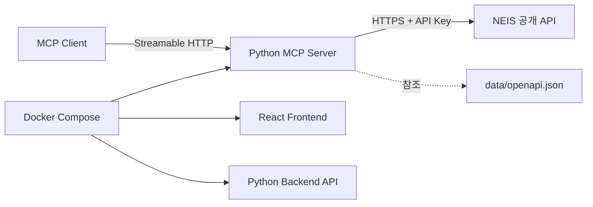

# 급식 배틀 - 학교 급식 조회 MCP 서버 TRD

## 1. 문서 개요

이 문서는 `PRD.md`의 요구사항을 구현하기 위한 기술 설계를 정의한다. 시스템은
기존 React 프론트엔드 및 Python 백엔드와 별도로, Python 기반 MCP 서버를
`src/mcp`에 구현하며 Docker Compose로 함께 빌드하고 실행한다.

## 2. 설계 원칙

- MCP 서버는 기존 웹 백엔드 API와 프로세스 및 책임이 분리된 독립 서비스로 둔다.
- MCP 서버는 NEIS API를 직접 호출하되, 브라우저와 기존 프론트엔드 경로에
  의존하지 않는다.
- NEIS API 키는 MCP 서버 환경 변수로만 관리한다.
- `data/openapi.json`을 NEIS 외부 API 계약의 기준으로 사용한다.
- 외부 응답은 신뢰하지 않고 MCP 서버 경계에서 검증하고 내부 도메인 모델로
  변환한다.
- 입력 오류, 빈 결과, 외부 서비스 오류, 타임아웃을 서로 다른 상태로 처리한다.
- 도구 설명과 입출력은 MCP 클라이언트가 바로 이해하고 사용할 수 있게 명확히
  설계한다.

## 3. 시스템 구성



### 런타임 책임

| 구성 요소 | 책임 | 금지 사항 |
|-----------|------|-----------|
| MCP 서버 | MCP 세션 초기화, 도구 등록, 입력 검증, NEIS 호출, 응답 검증·변환, MCP 오류 매핑 | 기존 백엔드 API에 프록시처럼 의존, API 키 로깅 |
| NEIS 클라이언트 | `data/openapi.json`에 정의된 요청 생성과 응답 파싱 | MCP 전송 계층과 결합된 로직 |
| Docker Compose | 프론트엔드, 기존 백엔드, MCP 서버 빌드 및 네트워크 연결 | 비밀 값을 이미지에 포함 |
| 기존 프론트엔드/백엔드 | 기존 웹 애플리케이션 역할 유지 | MCP 서버 책임 흡수 |

## 4. 권장 소스 구조

구현 단계에서 다음 책임 분리를 기준으로 하되, 선택한 라이브러리 관례에 맞게
세부 경로는 조정할 수 있다.

```text
.
├─ data/
│  └─ openapi.json
├─ src/
│  ├─ frontend/
│  ├─ backend/
│  └─ mcp/
│     ├─ app/
│     │  ├─ server/           # MCP 서버 초기화 및 transport 설정
│     │  ├─ tools/            # MCP 도구 정의
│     │  ├─ clients/          # NEIS 전용 클라이언트
│     │  ├─ models/           # 입력/출력 및 도메인 모델
│     │  ├─ services/         # 조회와 변환 로직
│     │  ├─ errors/           # MCP 오류 매핑
│     │  └─ config/           # 검증된 환경 설정
│     ├─ tests/
│     └─ Dockerfile
├─ tests/
│  └─ integration/
└─ compose.yaml
```

MCP 서버의 NEIS 클라이언트는 기존 백엔드 구현과 물리적으로 분리하되, 동일한
검증 규칙이나 파서가 재사용 가능하면 공용 모듈 추출을 고려할 수 있다. 단,
MCP 서버가 기존 백엔드 프로세스에 종속되어서는 안 된다.

## 5. 데이터 흐름

### 5.1 도구 목록 조회

1. MCP 클라이언트가 Streamable HTTP 엔드포인트에 연결한다.
2. MCP 서버는 세션 초기화와 프로토콜 협상을 처리한다.
3. 클라이언트의 도구 목록 요청에 대해 서버는 등록된 도구 메타데이터를 반환한다.
4. 최소한 학교 검색 도구와 급식 조회 도구가 목록에 포함된다.

### 5.2 학교 검색 도구

1. 사용자는 학교명 일부를 검색어로 전달해 도구를 호출한다.
2. MCP 서버는 검색어의 앞뒤 공백을 제거하고 비어 있지 않은지 검증한다.
3. 서버는 NEIS `/hub/schoolInfo`를 `Type=json`, `pIndex=1`,
   `pSize=SCHOOL_PAGE_SIZE`와 함께 호출한다.
4. 서버는 NEIS 응답을 검증하고 내부 `SchoolSummary` 목록으로 변환한다.
5. 서버는 반환 상한(`SCHOOL_RESULT_LIMIT`)을 적용하고 필요 시 결과가 더 많다는
   정보를 포함한다.
6. 서버는 도구 결과로 학교 목록을 반환한다.

### 5.3 중식 조회 도구

1. 사용자는 `officeCode`, `schoolCode`, `from`, `to`를 입력해 도구를 호출한다.
2. MCP 서버는 날짜 형식, 날짜 순서, 최대 조회 일수, 필수 학교 식별 정보를
   검증한다.
3. 서버는 NEIS `/hub/mealServiceDietInfo`에 다음 조건을 전달한다.
   - `ATPT_OFCDC_SC_CODE`: 교육청 코드
   - `SD_SCHUL_CODE`: 학교 코드
   - `MMEAL_SC_CODE`: 중식 식사구분코드(`"2"`)
   - `MLSV_FROM_YMD`, `MLSV_TO_YMD`: `YYYYMMDD` 형식 날짜 범위
   - `Type=json`, `pIndex`, `pSize`
4. 서버는 한 페이지를 넘는 결과가 있으면 `list_total_count`를 기준으로 페이지를
   순회해 기간 내 모든 중식을 수집한다.
5. 서버는 급식일 오름차순으로 정렬된 내부 `Meal` 목록으로 변환한다.
6. 서버는 도구 결과로 날짜별 중식 정보를 반환한다.

## 6. MCP 인터페이스 설계

### 6.1 전송 방식

- 서버 위치: `src/mcp`
- 전송 방식: Streamable HTTP
- 서버는 MCP 클라이언트의 도구 조회와 도구 호출 요청을 모두 처리해야 한다.
- 개발 환경에서는 Compose 네트워크 또는 호스트에서 접근 가능한 고정 포트를
  사용한다.
- 장시간 블로킹을 방지하기 위해 상위 API 호출과 전체 요청 처리 시간에 타임아웃을
  둔다.

### 6.2 도구 정의

구현 시 실제 MCP 라이브러리 스키마 형식에 맞추되 다음 의미를 보존한다.

#### 도구 1: 학교 검색

- **이름**: `search_schools`
- **설명**: 학교 이름 일부를 입력받아 후보 학교와 식별 정보를 조회한다.
- **입력**

| 필드 | 타입 | 필수 | 설명 |
|------|------|------|------|
| `query` | string | 예 | 공백 제거 후 비어 있지 않은 학교명 일부 |

- **성공 출력**

| 필드 | 타입 | 필수 | 설명 |
|------|------|------|------|
| `items` | 학교 항목 배열 | 예 | 검색된 학교 목록 |
| `total` | integer | 예 | NEIS 기준 전체 건수 |
| `hasMore` | boolean | 예 | 반환 상한을 초과하는 추가 결과 존재 여부 |

학교 항목:

| 필드 | 타입 | 필수 | 설명 |
|------|------|------|------|
| `officeCode` | string | 예 | 시도교육청 코드 |
| `schoolCode` | string | 예 | 학교 행정표준코드 |
| `name` | string | 예 | 학교명 |
| `region` | string | 예 | 소재 지역 |
| `schoolType` | string | 예 | 학교 종류 |

#### 도구 2: 중식 조회

- **이름**: `get_lunch_meals`
- **설명**: 학교 식별 정보와 날짜 범위를 입력받아 중식 기준 급식 정보를 조회한다.
- **입력**

| 필드 | 타입 | 필수 | 설명 |
|------|------|------|------|
| `officeCode` | string | 예 | 시도교육청 코드 |
| `schoolCode` | string | 예 | 학교 행정표준코드 |
| `from` | string | 예 | `YYYY-MM-DD` 시작일 |
| `to` | string | 예 | `YYYY-MM-DD` 종료일 |

- **성공 출력**

| 필드 | 타입 | 필수 | 설명 |
|------|------|------|------|
| `items` | 급식 항목 배열 | 예 | 날짜순 급식 목록 |

급식 항목:

| 필드 | 타입 | 필수 | 설명 |
|------|------|------|------|
| `date` | `YYYY-MM-DD` | 예 | 급식일 |
| `mealType` | string | 예 | 식사 구분명 |
| `menu` | 메뉴 항목 배열 | 예 | 메뉴와 알레르기 표기 |
| `calories` | `Measurement` | 아니요 | 열량 정보 |
| `nutrients` | `Measurement` 배열 | 예 | 정규화 가능한 영양소 |
| `nutritionText` | string | 아니요 | 영양 정보 원문 |
| `origin` | string | 아니요 | 원산지 정보 |

메뉴 항목은 `name: string`, `allergyCodes: string[]`를 포함한다.

`Measurement`는 `label`, `value`, `unit`, `sourceText`를 포함한다.

## 7. 도메인 및 데이터 모델

### 7.1 학교 모델

| 내부 필드 | 타입 | 설명 | NEIS 필드 |
|-----------|------|------|-----------|
| `officeCode` | string | 시도교육청 코드 | `ATPT_OFCDC_SC_CODE` |
| `schoolCode` | string | 학교 코드 | `SD_SCHUL_CODE` |
| `name` | string | 학교명 | `SCHUL_NM` |
| `region` | string | 소재 지역 | `LCTN_SC_NM` |
| `schoolType` | string | 학교 종류 | `SCHUL_KND_SC_NM` |

식별 필드(`officeCode`, `schoolCode`, `name`)가 없으면 해당 항목은 폐기하고 잘못된
외부 응답으로 기록한다. `region`, `schoolType`은 빈 문자열을 허용하되 추정하지
않는다.

### 7.2 급식 모델

| 내부 필드 | 타입 | 설명 | NEIS 필드 |
|-----------|------|------|-----------|
| `date` | string | `YYYY-MM-DD` 급식일 | `MLSV_YMD` |
| `mealType` | string | 식사 구분명 | `MMEAL_SC_NM` |
| `menu` | `MenuItem[]` | 메뉴 목록 | `DDISH_NM` |
| `calories` | `Measurement?` | 열량 정보 | `CAL_INFO` |
| `nutrients` | `Measurement[]` | 정규화된 영양소 | `NTR_INFO` |
| `nutritionText` | `string?` | 영양 정보 원문 | `NTR_INFO` |
| `origin` | `string?` | 원산지 정보 | `ORPLC_INFO` |

필수 필드(`date`, `mealType`)가 없거나 날짜 형식이 깨진 항목은 성공 데이터로
반환하지 않는다.

### 7.3 메뉴 및 측정값 파싱

- `DDISH_NM`은 줄 구분 기준으로 메뉴를 분리한다.
- 각 메뉴 문자열의 인라인 알레르기 표기(예: `1.2.5.`)를 해석해
  `allergyCodes`로 분리하되, 해석에 실패하면 원문 의미를 유지한다.
- `CAL_INFO`와 `NTR_INFO`는 수치와 단위를 확인할 수 있을 때만 `Measurement`로
  변환한다.
- 정규화하지 못한 영양 정보는 `nutritionText`에 원문을 보존한다.
- 값을 추정하거나 임의의 기본값을 만들지 않는다.

## 8. 오류 처리 설계

### 8.1 오류 분류

| 분류 | 상황 | 기대 처리 |
|------|------|-----------|
| 입력 오류 | 빈 검색어, 누락 필드, 잘못된 날짜 형식, 역전된 날짜 범위, 최대 일수 초과 | MCP 표준에 맞는 클라이언트 오류 반환 |
| 빈 결과 | 학교 검색 결과 없음, 기간 내 급식 없음 | 성공 응답의 빈 목록 또는 명시적 안내 |
| 외부 서비스 오류 | 인증키 오류, 요청 제한, 잘못된 응답 | 민감 정보 없는 서버 측 오류 반환 |
| 일시적 장애 | 타임아웃, 연결 실패, 상위 서버 장애 | 재시도 가능성을 암시하는 오류 반환 |
| 내부 오류 | 처리되지 않은 예외 | 일반화된 오류 반환 및 서버 측 추적 |

### 8.2 내부 오류 코드

| 내부 코드 | 상황 |
|-----------|------|
| `EMPTY_QUERY` | 학교 검색어가 비어 있음 |
| `MISSING_FIELD` | 필수 입력이 누락됨 |
| `INVALID_DATE` | 날짜 형식 또는 캘린더 값이 유효하지 않음 |
| `INVALID_DATE_RANGE` | 시작일이 종료일보다 늦음 |
| `DATE_RANGE_TOO_LARGE` | 조회 범위가 최대 허용 일수를 초과 |
| `NO_SCHOOLS_FOUND` | 학교 검색 결과 없음 |
| `NO_MEALS_FOUND` | 급식 정보 없음 |
| `NEIS_RATE_LIMITED` | NEIS 요청 제한 초과 |
| `NEIS_UNAUTHORIZED` | NEIS 인증키 오류 |
| `NEIS_INVALID_RESPONSE` | NEIS 응답이 계약과 불일치 |
| `NEIS_TIMEOUT` | NEIS 연결 또는 응답 시간 초과 |
| `INTERNAL_ERROR` | 처리되지 않은 내부 오류 |

### 8.3 MCP 응답 원칙

- 오류 응답에는 사용자 노출 가능한 메시지와 안정적인 내부 오류 코드를 포함한다.
- 상세 스택, API 키, 인증 쿼리 문자열, 원본 비밀값은 포함하지 않는다.
- 학교 검색 결과 없음과 급식 정보 없음은 프로토콜 오류가 아니라 도구 결과 차원의
  빈 상태로 우선 표현한다.
- MCP 라이브러리 제약상 구조화 오류 본문이 제한되면, 최소한 민감 정보 없는
  설명 메시지와 서버 로그의 상관관계 ID를 남긴다.

## 9. NEIS API 연동

- 기준 명세: `data/openapi.json`
- 서버: `https://open.neis.go.kr`
- 학교 검색: `GET /hub/schoolInfo`
- 급식 조회: `GET /hub/mealServiceDietInfo`
- 인증: 쿼리 매개변수 `Key`; MCP 서버 환경 변수에서 주입
- 응답 형식: JSON

NEIS는 HTTP 성공 응답 안에도 결과 코드와 빈 데이터 안내를 포함할 수 있으므로,
HTTP 상태와 본문 `RESULT.CODE`를 함께 검사한다. 인증 실패, 잘못된 요청, 데이터
없음, 요청 제한, 서버 오류를 내부 상태로 명시적으로 매핑한다.

### 9.1 RESULT 코드 매핑

| NEIS 결과 | 내부 처리 |
|-----------|-----------|
| 정상 처리(`INFO-000`) | 데이터 변환 후 성공 반환 |
| 데이터 없음(정보성 안내 코드 또는 HTTP `404`) | 빈 목록 반환 |
| 인증키 오류 | `NEIS_UNAUTHORIZED` |
| 필수값 누락·잘못된 요청 | `NEIS_INVALID_RESPONSE` 또는 입력 오류 |
| 요청 제한 초과 | `NEIS_RATE_LIMITED` |
| 서버 오류·타임아웃 | `NEIS_TIMEOUT` 또는 일반 외부 오류 |

정확한 코드 문자열은 구현 시 실제 응답으로 확정하되, 매핑 정책은 위 의미를
보존한다.

## 10. 백엔드 설계

### 계층별 책임

- 서버 계층: Streamable HTTP 엔드포인트 구성, MCP 초기화, 도구 등록
- 도구 계층: 입력 스키마 정의, 요청 위임, 응답 직렬화
- 서비스 계층: 유스케이스 실행, 중식 조건 보장, 정렬과 내부 모델 변환
- NEIS 클라이언트 계층: 인증된 외부 요청, 타임아웃, 외부 오류 및 응답 파싱
- 설정 계층: 시작 시 필수 환경 변수 검증

### 성능 및 신뢰성 목표

- NEIS 연결 타임아웃 기본 3초, 응답 타임아웃 기본 10초
- 안전한 조회 재시도는 최대 2회까지 허용할 수 있음
- 요청 제한, 인증 오류, 입력 오류는 무분별하게 재시도하지 않음
- MCP 도구 호출 전체가 무한 대기에 빠지지 않도록 상위 타임아웃을 둠

### 관측성

- 요청마다 상관관계 ID를 부여한다.
- 도구 이름, 소요 시간, 결과, 정제된 상위 API 상태를 구조적 로그로 남긴다.
- 로그와 예외 메시지에서 API 키와 인증 쿼리를 마스킹한다.

## 11. 환경 설정 및 Compose 구성

### 11.1 환경 변수

| 변수 | 필수 | 설명 |
|------|------|------|
| `NEIS_API_KEY` | 예 | MCP 서버가 사용하는 NEIS API 키 |
| `NEIS_BASE_URL` | 아니요 | 기본값은 NEIS 서버 URL |
| `MCP_PORT` | 아니요 | MCP 서버 수신 포트 |
| `SCHOOL_PAGE_SIZE` | 아니요 | 학교 검색 NEIS 페이지 크기(기본 100) |
| `SCHOOL_RESULT_LIMIT` | 아니요 | 학교 검색 반환 상한(기본 100) |
| `MEAL_MAX_RANGE_DAYS` | 아니요 | 급식 조회 최대 일수(기본 31) |
| `NEIS_CONNECT_TIMEOUT` | 아니요 | NEIS 연결 타임아웃 초(기본 3) |
| `NEIS_READ_TIMEOUT` | 아니요 | NEIS 응답 타임아웃 초(기본 10) |
| `NEIS_MAX_RETRIES` | 아니요 | 안전한 조회 재시도 횟수(기본 2) |

실제 비밀 값은 저장소에 커밋하지 않는다.

### 11.2 Docker Compose

- `frontend`, `backend`, `mcp` 서비스를 각각의 Dockerfile에서 빌드한다.
- `mcp` 서비스는 독립 프로세스로 실행되며 `backend` 서비스에 의존하지 않는다.
- 필요한 포트만 호스트에 공개하고 서비스 간 통신은 Compose 네트워크를 사용한다.
- 브라우저에 노출되는 프론트엔드 환경에는 `NEIS_API_KEY`를 전달하지 않는다.
- 개발자 환경 설정은 `.env`로 주입하되 Compose 파일이나 이미지 레이어에 비밀 값을
  하드코딩하지 않는다.
- 단일 Compose 명령으로 세 서비스를 함께 빌드하고 실행할 수 있어야 한다.

## 12. 테스트 전략

### 12.1 단위 테스트

- 학교 검색 입력 검증(빈 검색어, 공백 처리)
- 날짜 입력 및 날짜 범위 검증(형식, 역전, 최대 일수 초과)
- NEIS 학교 응답을 내부 학교 모델로 변환
- NEIS 급식 응답을 내부 급식 모델로 변환
- 중식 조건(`MMEAL_SC_CODE="2"`) 적용과 급식일 정렬
- 메뉴 알레르기 표기 파싱과 원문 보존
- 열량·영양 정보 정규화와 원문 보존
- NEIS `RESULT.CODE`와 예외를 내부 오류 코드로 매핑
- 로그와 오류 응답에 API 키가 포함되지 않음

### 12.2 통합 테스트

- MCP 클라이언트 수준의 도구 목록 조회 성공
- 학교 검색 도구 호출의 요청, 변환 및 성공 응답
- 급식 조회 도구 호출의 요청, 페이지 순회 및 성공 응답
- 학교 검색 결과 없음 처리
- 급식 정보 없음 처리
- 잘못된 입력에 대한 MCP 오류 응답
- NEIS 인증, 요청 제한, 서버 오류 및 타임아웃 매핑
- Compose 환경에서 MCP 서버 기동 확인

### 12.3 선택적 상호운용 검증

- 실제 MCP 클라이언트 또는 프로토콜 호환 테스트 도구로 Streamable HTTP 연결 검증
- 실제 NEIS API 의존 검증은 선택적 테스트로 분리해 기본 CI의 결정성을 해치지
  않게 한다.

## 13. 요구사항 추적성

| PRD 요구사항 | 기술 설계 | 주요 검증 |
|--------------|-----------|-----------|
| FR-01 Streamable HTTP 서버 | MCP 서버 계층, transport 구성 | 통합 테스트 |
| FR-02 백엔드와 독립 실행 | 별도 `src/mcp`, Compose `mcp` 서비스 | 통합 테스트, Compose 기동 |
| FR-03~FR-04 학교 검색 도구 | `search_schools` 도구, 학교 모델 매핑 | 단위·통합 테스트 |
| FR-05~FR-07 중식 조회 도구 | `get_lunch_meals` 도구, 급식 모델 변환 | 단위·통합 테스트 |
| FR-08 오류 처리 | 오류 코드 체계, MCP 오류 매핑 | 단위·통합 테스트 |
| FR-09 Compose 포함 | `mcp` 서비스와 환경 변수 구성 | 통합 테스트 |
| FR-10 테스트 제공 | 단위 및 통합 테스트 전략 | CI 또는 로컬 검증 |

## 14. 완료 기준

- Python 기반 MCP 서버가 `src/mcp`에 구현되어 있다.
- MCP 클라이언트가 Streamable HTTP 방식으로 연결해 도구 목록을 조회할 수 있다.
- 학교 검색 및 중식 조회 도구가 `data/openapi.json` 기반으로 동작한다.
- 입력 오류, 빈 결과, NEIS 오류, 타임아웃이 민감 정보 없이 구분되어 처리된다.
- Docker Compose가 프론트엔드, 기존 백엔드, MCP 서버를 함께 실행한다.
- 단위 및 통합 테스트가 핵심 정상·실패 흐름을 검증한다.
